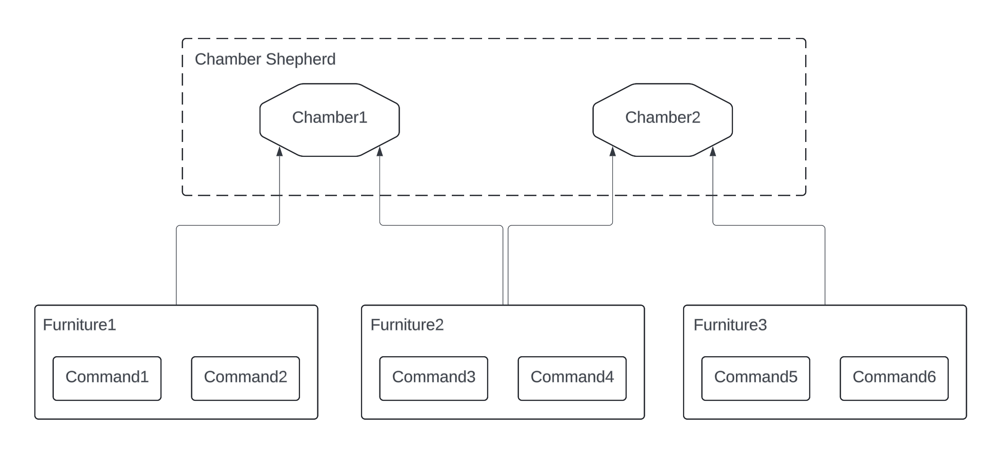

# Development

## Prerequisites and Dependencies

This project utilizes Gradle as its package manager. For detailed insights into plugins, dependencies, tasks, and related aspects, please refer to the `build.gradle.kts` file. Ensure that Gradle version 8.7 or higher and Java version 21 or higher are installed for compatibility.

The dependencies are as follows:

* [Spring Boot 3](https://docs.spring.io/spring-boot/docs/current/reference/htmlsingle/)
* [Picocli](https://picocli.info)
* [JLine](https://github.com/jline/jline3)
* [Gson](https://github.com/google/gson/blob/main/UserGuide.md)

## Architecture

### General

Burrow manages a collection of chambers using a chamber shepherd. Each chamber comprises several pieces of furniture, with each piece containing a list of commands tailored to a specific mission. The commands managed by each piece of furniture are dedicated to fulfilling its particular purpose.

A chamber is essentially a group of furniture. Creating a chamber involves simply creating a configuration file and specifying the list of furniture. When a chamber is initiated by the chamber shepherd, all the furniture and their dependencies are loaded, and their respective commands are ready to use.

This architecture fully modularizes different functions by encapsulating them into separate pieces of furniture. Additionally, the process of creating or copying a custom chamber, which serves as a console app, is streamlined and straightforward.

Within this architecture, there is a significant module called Hoard. A Hoard manages a collection of entries, each with a unique ID and various properties. By default, these entries are stored in a JSON file located in the chamber's root directory. Each chamber manages one Hoard, and any piece of furniture can perform CRUD operations (Create, Read, Update, Delete) on these entries. Furthermore, furniture can control the processes of creating, modifying, and deleting entries by overriding specific methods.

For example, the built-in furniture `Time` automatically adds `created_at` and `updated_at` properties whenever an entry is created, and updates the `updated_time` property whenever the entry is modified. By including this furniture in a chamber's configuration file, these functionalities are seamlessly integrated and activated.

### Server and Client

Burrow is developed in Java, and each time a chamber is used, the hoard is loaded from a JSON file, resulting in lengthy startup times. This issue worsens as the hoard grows larger. To address this, Burrow comprises a server end and a client end. The server end initiates the chamber and preloads all necessary data into memory. The client end interacts with the chamber by sending requests to the server and displaying the response messages.

To simplify, the client end and server end communicates with HTTP. The kernel and the server are developed with Spring Boot, a popular and comprehensive framework.

## Kernel

The core package of Burrow's kernel is `me.jameschan.burrow.kernel`, which contains several key modules. Each module is a class extending ChamberModule:

* `config.Config`: Manages the configuration settings of a chamber.
* `command.Command`: Executes a specific action within a given request context.
* `entry.Hoard`: Manages a collection of entries.
* `furniture.Renovator`: Manages all the furniture a chamber has.
* `Furniture`: Represents a piece of furniture that contains a collection of commands and specific functionalities.
* `formatter.Formatter`: Controls the format for displaying entries, lists, and other output.

The Chamber class includes a `context.ChamberContext` object, which holds built-in chamber module objects, root directories, crucial file paths, and the chamber itself. The chamber context is used throughout the entire lifecycle of the chamber, while a request context is specific to a single request.

After a chamber is created, it must be initiated to become active. The `initiate` method constructs the chamber context and loads all necessary components from the chamber's root directory. When the chamber is no longer needed, the `terminate` method is called to properly shut it down.

### Config

### Command

### Hoard

### Renovator

### Formatter